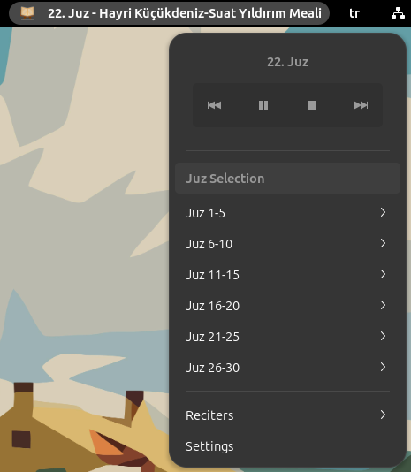
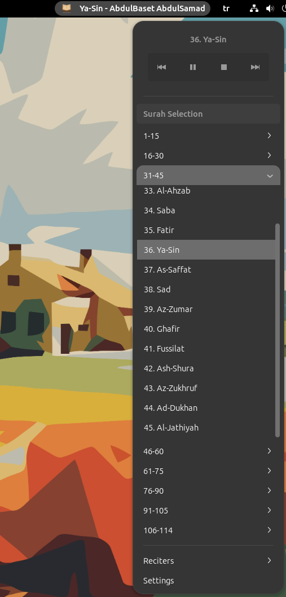
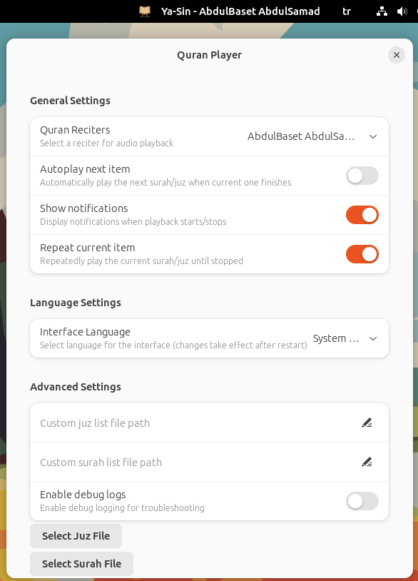

# Quran Player GNOME Shell Extension


**Author:** [faymaz](https://github.com/faymaz)








A GNOME Shell extension that lets you listen to Quran recitations directly from your desktop.

## Features

- Full list of all 114 Quran surahs organized in groups
- Multiple reciter options including Mustafa Ismail and Abdulbasit Abdussamed
- Playback controls (play/pause, next, previous, stop)
- Customizable settings
- Notifications for playback status
- Support for custom reciter lists

## Requirements

- GNOME Shell 45 or newer
- glib-compile-schemas (part of glib2.0-dev package)
- make (optional, for Makefile installation)

## Installation

### Using the Makefile (recommended)

1. Clone or download this repository
2. Open a terminal in the extension directory
3. Run:
   ```bash
   make install
   ```
4. Restart GNOME Shell:
   - On X11: Press Alt+F2, type 'r', and press Enter
   - On Wayland: Log out and log back in
5. Enable the extension:
   ```bash
   gnome-extensions enable quran-player@faymaz.github.com
   ```

### Manual Installation

1. Create the extension directory:
   ```bash
   mkdir -p ~/.local/share/gnome-shell/extensions/quran-player@faymaz.github.com
   ```

2. Copy all files to the extension directory:
   ```bash
   cp -r extension.js prefs.js metadata.json stylesheet.css surahs.json custom-reciters.json ~/.local/share/gnome-shell/extensions/quran-player@faymaz.github.com/
   ```

3. Create and compile the schema:
   ```bash
   mkdir -p ~/.local/share/gnome-shell/extensions/quran-player@faymaz.github.com/schemas
   cp org.gnome.shell.extensions.quran-player.gschema.xml ~/.local/share/gnome-shell/extensions/quran-player@faymaz.github.com/schemas/
   cd ~/.local/share/gnome-shell/extensions/quran-player@faymaz.github.com/schemas
   glib-compile-schemas .
   ```

4. Restart GNOME Shell and enable the extension as described above.

## Usage

After installation, you'll see a headphones icon in the GNOME top bar. Click it to open the Quran Player menu.

### Main Features

- Browse surahs by group (organized in sets of 15)
- Click on any surah to start playback
- Use the player controls to:
  - Play/Pause
  - Stop
  - Skip to previous surah
  - Skip to next surah
- Select different reciters from the Reciters submenu
- Access settings from the menu

### Settings

Access the extension settings by:
- Clicking "Settings" in the extension menu
- Or using GNOME Extensions app and clicking the gear icon next to the extension

In the settings panel, you can:
- Select your preferred reciter
- Toggle autoplay for the next surah
- Enable/disable notifications
- Set a custom surah list file
- Enable debug logging for troubleshooting

## Customization

### Custom Reciters

You can edit the `custom-reciters.json` file to add or modify reciters. The format is:

```json
[
  {
    "name": "Reciter Name",
    "baseUrl": "https://example.com/path/to/audio/",
    "audioFormat": "%id%.mp3"
  }
]
```

The `audioFormat` field supports these placeholders:
- `%id%`: 3-digit surah number (001, 002, etc.)
- `%audioId%`: The audioId from surahs.json
- `%name%`: Surah name


## Troubleshooting

If the extension doesn't work:

1. Make sure you're using GNOME Shell 45 or newer
2. Check for errors in Looking Glass (Alt+F2, type 'lg')
3. Make sure the schema file is correctly compiled
4. Verify that `~/.local/share/gnome-shell/extensions/quran-player@faymaz.github.com/schemas/` contains `gschemas.compiled`
5. Enable debug logging in the extension settings and check the logs

## Contributing

Suggestions, bug reports, and pull requests are welcome on GitHub!